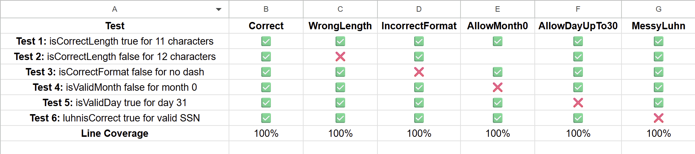
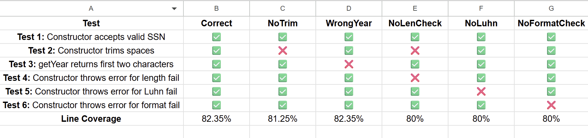

# Test Report for SSNHelper and SwedishSocialSecurityNumber Classes

### Part 1: SSNHelper - Test Suite Summary
- Total tests: 6
- Coverage achieved: 100% line coverage

### Test Descriptions
1. **Test 1:** `isCorrectLength should return true for a 11 character string`
- Tests valid length boundary (11 characters)

2. **Test 2:** `isCorrectLength should return false for a 12 character string`
- Tests valid length
- Detects that BuggySSNHelperWrongLength uses >= instead of ==

3. **Test 3:** `isCorrectFormat should return false for a string without dash`
- Tests format validation
- Detects that BuggySSNHelperIncorrectFormat always returns true

4. **Test 4:** `isValidMonth should return false for month zero`
- Tests month boundary value
- Detects that BuggySSNHelperAllowMonth0 accepts month >= 0

5. **Test 5:** `isValidDay should return true for day 31`
- Tests day over 31 boundary
- Detects that BuggySSNHelperAllowDayUpTo31 uses < 31 instead of <= 31

6. **Test 5:** `luhnisCorrect should return true for a valid luhn`
- Tests Luhn algorithm with valid SSN
- Detects that BuggySSNHelperMessyLuhn uses digit -= 11 instead of -= 9

---

### Part 2: SwedishSocialSecurityNumber - Test Suite Summary
- Total tests: 6
- Coverage achieved: 82.35% line coverage
- Uses Jest mocking to isolate tests

### Test Descriptions
1. **Test 1:** `constructor should accept valid SSN`
- Verifies that a valid SSN is accepted without errors

2. **Test 2:** `constructor should trim leading and trailing spaces`
- Detects that BuggySwedishSocialSecurityNumberNoTrim doesn't trim
- Verifies that helper is called with a trimmed string

3. **Test 3:** `getYear should return first two characters in the ssn`
- Detects that BuggySwedishSocialSecurityNumberWrongYear uses substring (1,3)

4. **Test 4:** `constructor should throw error when length check fails`
- Detects that in BuggySwedishSocialSecurityNumberNoLenCheck, check is commented out

5. **Test 5:** `constructor should throw error when luhn check fails`
- Detects that in BuggySwedishSocialSecurityNumberNoLuhn, check is commented out

6. **Test 6:** `constructor should throw error when format check fails`
- Detects BuggySwedishSocialSecurityNumberNoFormatCheck (My Custom Bug)
- Increases coverage to 82.35%

### My Custom Bug
**BuggySwedishSocialSecurityNumberNoFormatCheck** has the format commented out, allowing incorrectly formatted SSNs to be accepted.