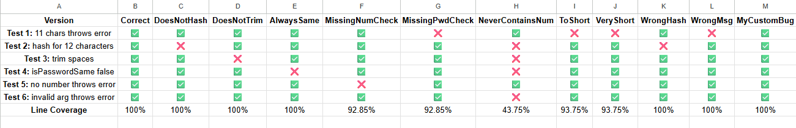

# Test Report for Password Class

### Test Suite Summary
- Total tests: 6
- Coverage achieved: 100% line coverage

### Test Descriptions
1. **Test 1:** `constructor should throw Too short password Error for a 11 character password`
- Tests boundary value (11 characters)
- Verifies error message

2. **Test 2:** `getPasswordHash should return correct Hash for 12 characters password`
- Tests valid password creation
- Verifies correct hash algorithm

3. **Test 3:** `getPasswordHas should return same hash for password with leading and trailing spaces`
- Tests trim functionality
- Verifies consistent hashing

4. **Test 4:** `isPasswordSame should return false for different passwords`
- Tests password comparison
- Verifies false case

5. **Test 5:** `constructor should throw No number found error for password without a number`
- Tests number validation
- Verifies error message

6. **Test 6:** `isPasswordSame should throw Invalid argument error for a non password argument`
- Tests error handling
- Achieves 100% coverage

### My Custom Bug
**MyCustomBug** requires a number to be at the end of the password, which all of the test passwords happen to have so the bug passes all of the tests.